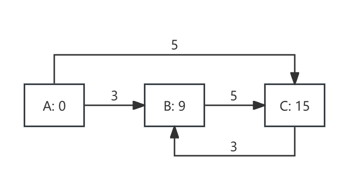
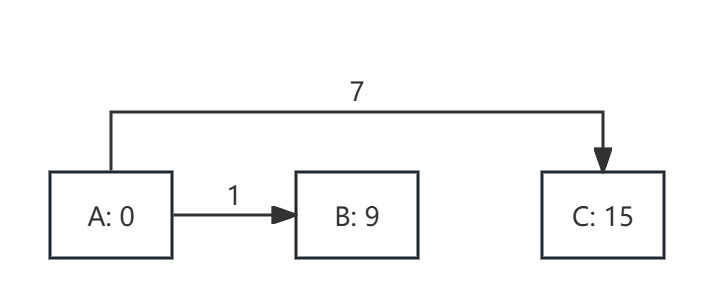

# Splitwise-MILP
The Splitwise-like algorithm using MILP encoding. The Splitwise app can be found at https://www.splitwise.com/.

## Motivation
I wrote a Splitwise algorithm using MILP encoding. During our trip to Yosemite (2024/08/16 - 2024/08/18), my senior recommended this app to split costs. I became very curious about its algorithm. So, I implemented a Splitwise-like algorithm based on MILP encoding (NP-Complete). Of course, you could also use LP encoding (which has P algorithms), but that would yield an approximately optimal solution.

## How To Run

Prepare the name list and payments. Add them to `persons` and `payments`, then run

`python splitwise_opt.py`

It will output the final optimal solution.

For example, `persons = ['A', 'B', 'C']` and `payments['A'] = 0, payments['B'] = 9, payments['C'] = 15`, it will outputs:
```
---Total Owe---
A should pay 8.00
B should get back 1.00
C should get back 7.00
---Solution Start---
A should pay B 1.00
A should pay C 7.00
---Solution end---
```

<div style="display: flex; justify-content: center; align-items: center;">

  <figure style="margin: 10px;">
    
    <figcaption style="text-align: center;">Before Optimization</figcaption>
  </figure>

  <figure style="margin: 10px;">
    
    <figcaption style="text-align: center;">After Optimization</figcaption>
  </figure>

</div>


## Theory Aspect: Encoding
We want to explicitly minimize the number of transactions. 

Assume we have $n$ persons involved. The payment is $P$, whereas $P(i)$ is the payment by person $i$. We can construct a complete graph connecting all persons. 

Then the weight of each directed edge from person $i$ to person $j$ is $w_{ij} = P(j) / n$.

We obtain an initial solution: $s_{ij}$, which means the amount that person $i$ should pay to person $j$. These are continuous constants where $s_{ij} = w_{ij}-w_{ji}$.

### Variables

Let $x_{ij}$ be a slack value reducing the amount that person $i$ pays to person $j$. These are continuous variables.

Let $y_{ij}$ be the final amount that person $i$ pays to person $j$. These are continuous variables (greater than or equal to zero for simplification).

Let $z_{ij}$ be a binary variable of {0, 1}, meaning whether $y_{ij}$ is zero; if $z_{ij}$ is zero, then $y_{ij}$ is zero.

### MILP Formulation:

#### Objective Function
Minimize the number of transactions: $\text{Minimize } \sum_{i \neq j} z_{ij}$

#### Constraints
- Solution Definition: $y_{ij} = s_{ij} - x_{ij}$
- Transaction Activation: $y_{ij} \leq M * z_{ij}$
- Transaction Invariant: $\sum_{i} y_{ij} - \sum_{i} y_{ji} = s_{ij}$

### LP Encoding (Sometimes Approximate)

#### Objective Function
Approximately, minimize the total amount of payments: $\text{Minimize } \sum_{i \neq j} y_{ij}$

#### Constraints
- Solution Definition: $y_{ij} = s_{ij} - x_{ij}$
- Transaction Invariant: $\sum_{i} y_{ij} - \sum_{i} y_{ji} = s_{ij}$
